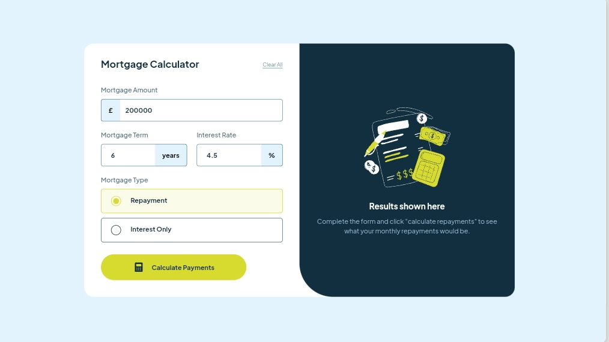

# Frontend Mentor - Mortgage repayment calculator solution

This is a solution to the [Mortgage repayment calculator challenge on Frontend Mentor](https://www.frontendmentor.io/challenges/mortgage-repayment-calculator-Galx1LXK73).

## Table of contents

- [Overview](#overview)
  - [The challenge](#the-challenge)
  - [Screenshot](#screenshot)
  - [Links](#links)
- [My process](#my-process)
  - [Built with](#built-with)
  - [What I learned](#what-i-learned)
- [Author](#author)

## Overview

### The challenge

Users should be able to:

- Input mortgage information and see monthly repayment and total repayment amounts after submitting the form
- See form validation messages if any field is incomplete
- Complete the form only using their keyboard
- View the optimal layout for the interface depending on their device's screen size
- See hover and focus states for all interactive elements on the page

### Solution

### Links

- Solution URL: [Source Code](https://github.com/elo-manny/Mortgage-Calculator-App)
- Live Site URL: [Live Preview](https://elo-manny.github.io/Mortgage-Calculator-App/)

## My process

### Built with

- HTML5 for markup, 
- CSS with custom properties for styling,
- ES6 Classes in JavaScript for the interactive components.

### What I learned

I learned how to optimize form inputs for accessibility and how to manage form state efficiently using JavaScript.

## Author

- Frontend Mentor - [@elo-manny](https://www.frontendmentor.io/profile/elo-manny)
